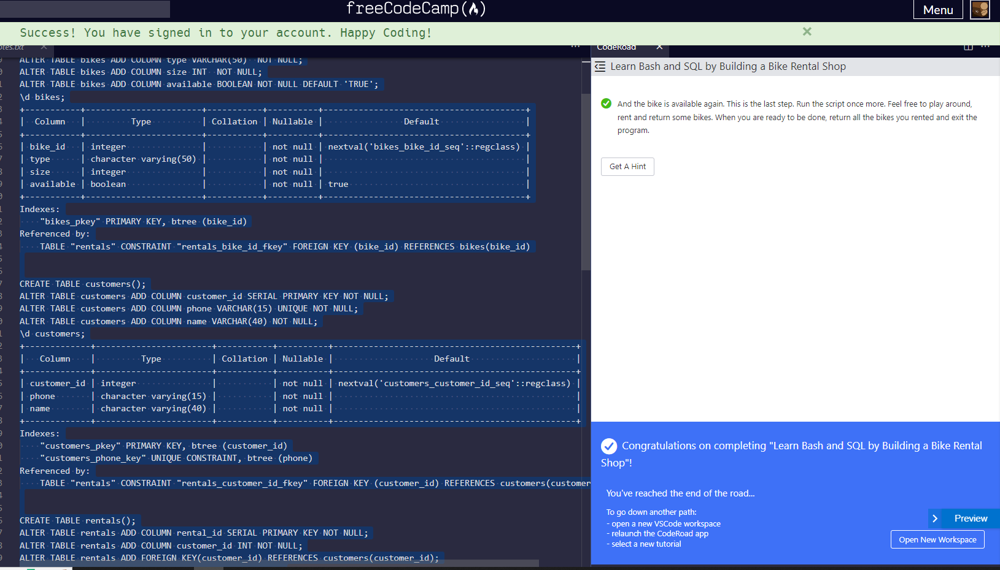

# Building A Bike Rental Shop Database

This exercise emphasizes on relational database topics of one-to-one, one-to-many, and many-to-many relationships.

You walk away with a clearer understanding of efficient table creation and querying for JOIN logics.

The best way I know how to comprehen relational tables is by visualizing the Venn diagrams with shaded areas, and the nature of joining (left, right, inner, full).

 

A note, RDMB is as much about the meta data and the relational logic that binds and makes sense of the data.  So much works go into writing the procedural language (SQL functions/procedures) to enable efficient queries.  These must be througly tested to ensure your API outputs are accurate.

 

The key takeaway is data is the most valuable part of any software solutions.  Spend your time to get to know your data.  

For the kind of solutions I have developed, data is the starting point of my R&D.  Prototyping using Bash scripting and Postgres DB has been essential to my practice.

This has been a good exercise.

Thanks FCC!

[back](https://github.com/hurricanemark/relational_database#learn-bash-and-sql-by-building-a-bike-rental-shop)

