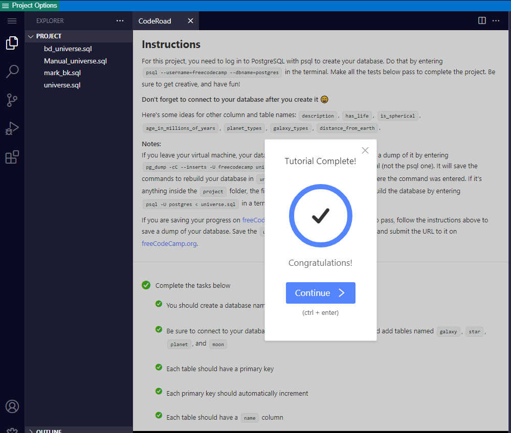

# Building A Celestial Bodies Database

I have developed a few enterprise software solutions using MySQL, Procedural Language\SQL.  PostgresSQL and PL\pSql was not so different.  I was able to breeze through this exercise fairly quick.

This exercise once again emphasizes on relational database topics of one-to-one, one-to-many, and many-to-many relationships.

You walk away with a clearer understanding of efficient table creation and querying for JOIN logics.

The best way I know how to understand relational tables is by visualizing the Venn diagrams with shaded areas.

This has been a good exercise.

Thanks FCC!

[back](https://github.com/hurricanemark/relational_database#celestial-bodies-database)

[freecodecamp database exercise](https://www.freecodecamp.org/learn/relational-database/build-a-celestial-bodies-database-project/build-a-celestial-bodies-database)

