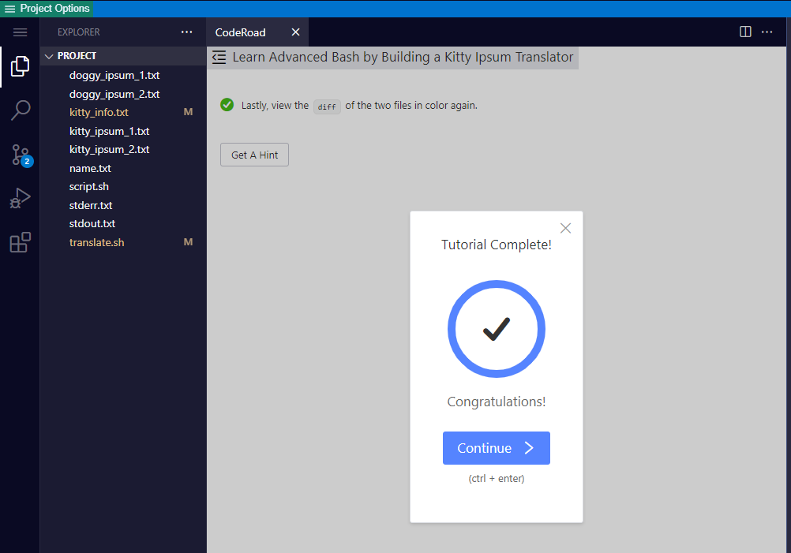

# Building A Kitty Ipsum Translator

This exercise emphasis is on parsing text files with bash scripting.  It involves writing shell script functions using typical Linux commands(cat, read, grep, sed, awk, etc..), plus some regex.

I have know doubt that most of us have to concentrate very hard writing and tracing regex; hmm, there is nothing regular about `regular expresion`!

I highly recommend to refresh your knowledge by going over this execrise.  It was well wprth the time!

Thanks FCC.

[back](https://github.com/hurricanemark/relational_database#learn-advanced-bash-by-building-a-kitty-ipsum-translator)

 

