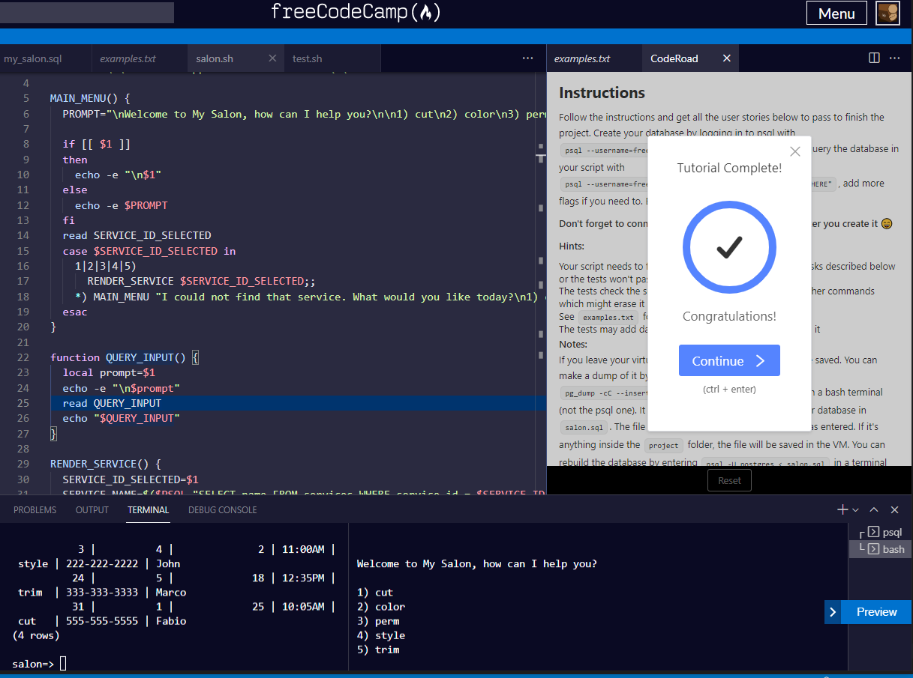

# Building A Salon Service Appointment Scheduler

Someone gave you a rough sketch of expected output and tell you to go creating a input plus programming logics to drive the i/o.

Using the `case studies`, you create a relational database containing tables having primary/foreigh keys, unique contraints to tide the chain event of making service appointments.

To drive the logics requires a shell script.  This is where you flesh out bugs introduced in the database procedural language.

Thanks FCC!

[back](https://github.com/hurricanemark/relational_database#salon-appointment-scheduler)

 

