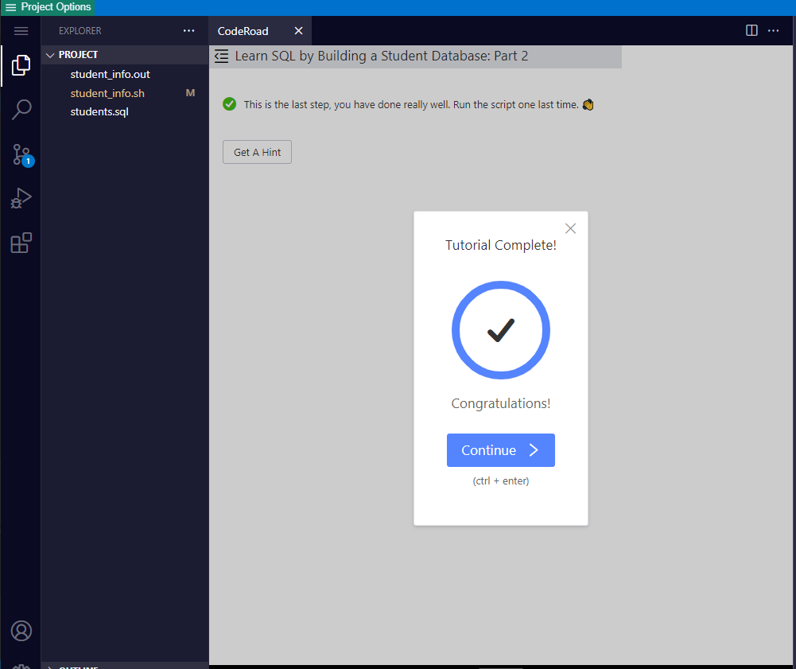

# Building A Student Database From CSV File

This exercise emphasizes on extracting raw data (csv data) to create an operable database that you can analyze, and perform future CRUD operations.

* You are using BASH script to create database with relational tables.  Then read, parse, and populate the CSV data into those tables.

* Perform logical query outputs to verify test questions.

## Lesson learned

* Good exercise to refresh on database procedural language.  

* Part 2: This is where you will hit paved dirt running.  You will learn a tons about SQL (see `insert_data.sh` file).  Pay attention to logical JOIN operations.

[back](https://github.com/hurricanemark/relational_database#learn-sql-by-building-a-student-database-part-1)

 

