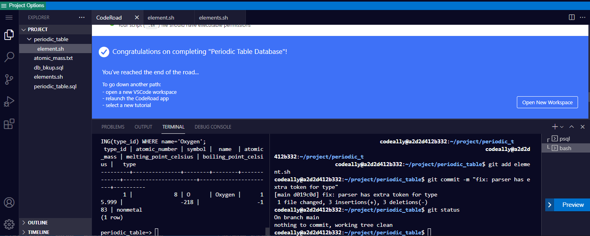

# Building A Periodic Table Database

In the spirit of continuation on the database building theme, you are given a simple text file with two columns headings and a corrupted database `periodic_table`:

```text
atomic_number | atomic_mass
1             |       1.008
2             |      4.0026
3             |        6.94
4             |      9.0122
5             |       10.81
6             |      12.011
7             |      14.007
8             |      15.999
9             |      18.998
10            |       20.18
```

Now, go fix the database to satisfy certain criterias, then perform the CRUD operations (note that I am so ingrained in API development that I use the term CRUD here.  But, you understand what I meant).  

## Caveats

* This caused me to stumble a bit: - In order to `SET NOT NULL` to a column, it must not be empty.  To save a headache, you should SET NOT NULL first before `ALTER COLUMN TYPE`.

* Use bash regex to deferentiate input as atomic_number, or symbol, or name.  Put more time in to flesh out edge cases.

## Lessons learned

* Use git branches to issolate each small increment of fixes.

* More reinforcement on SQL query practice.  Nice!

* Interactive script requires attention to details asked by the FCC tests.

[back](https://github.com/hurricanemark/relational_database#relational-database-certification)

<br>




