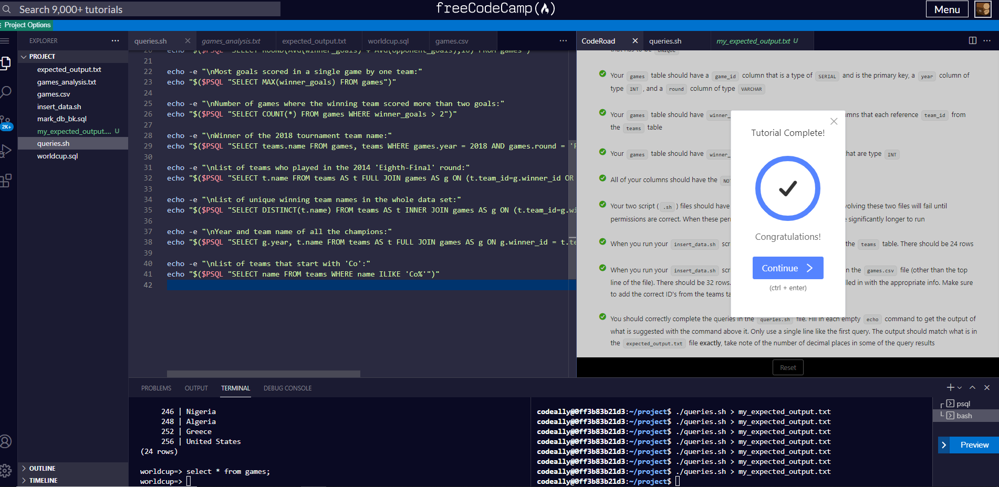

# Building A World Cup Database

Someone gave you a csv file containing game scores and told you to go make a database for them.  Yup, it's like that with this exercise.

Reading commas delemitted data is easy; there is some set rules to it that you can rely on.  i.e.  You expect to have a heading to know what the content is about.

You can use educated guess to scope out the data type from the description.  Also, you can envision the relationship between the columns and how to best organize them for efficient querying.

Great lesson.  Thanks FCC!

[back](https://github.com/hurricanemark/relational_database#world-cup-database)

 

