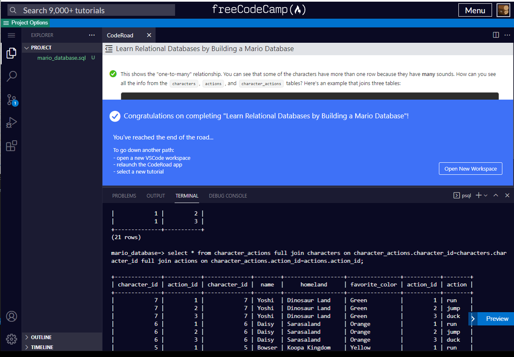

# Building Mario Bros Database

This is one of the more intense exercise on PostgreSQL.

You would start out performing single action SQL like pulling teeth.  You gradually advance toward more complex queries and eventually learn the inner working of the followings. 

### **one-to-one** tables construction:

Where: both tables have primary key used as UNIQUE foreign key to one another.

### **one-to-many** tables construnction

Where: both tables have primary key used as foreign key to one another.  (absent UNIQUE key).

### **many-to-many** table construction

This relationship requires an extra juntion table used to link the prior two tables together forming two "one-to-many" relationship.

[back](https://github.com/hurricanemark/relational_database#learn-relational-databases-by-building-a-mario-database)

 

