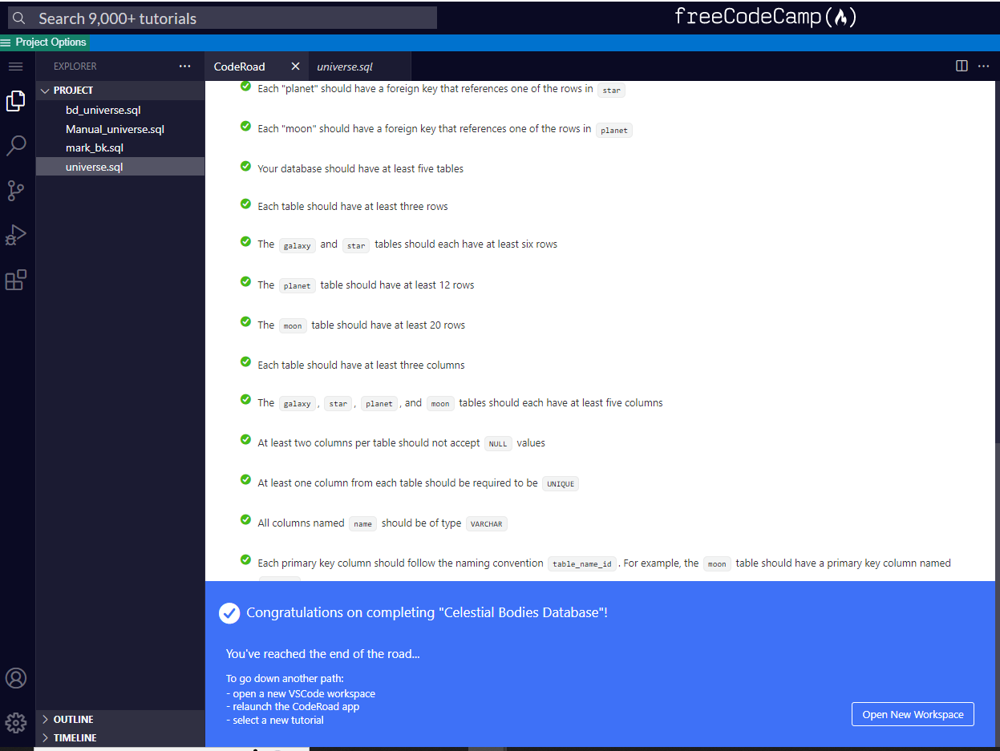

# universe -- Celestial Bodies Database

[freecodecamp database exercise](https://www.freecodecamp.org/learn/relational-database/build-a-celestial-bodies-database-project/build-a-celestial-bodies-database)

Postgres SQL rocks!

